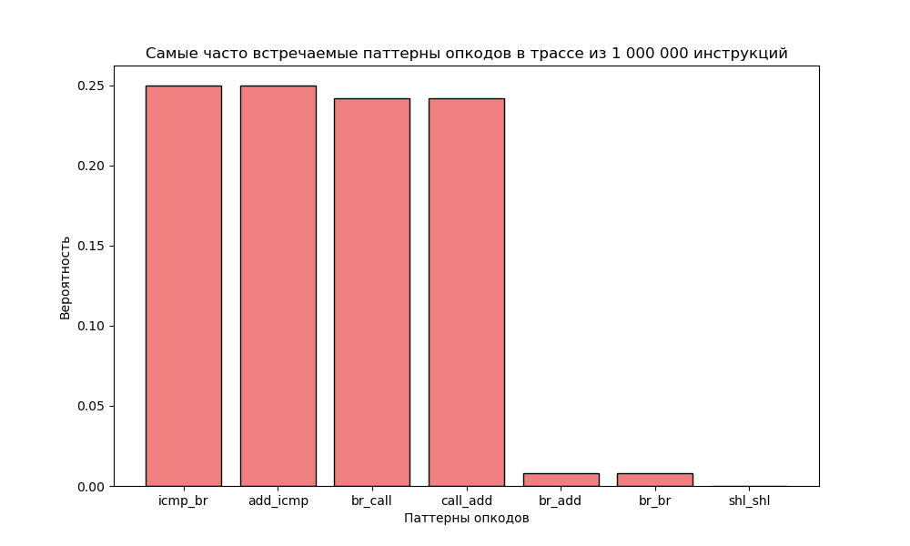
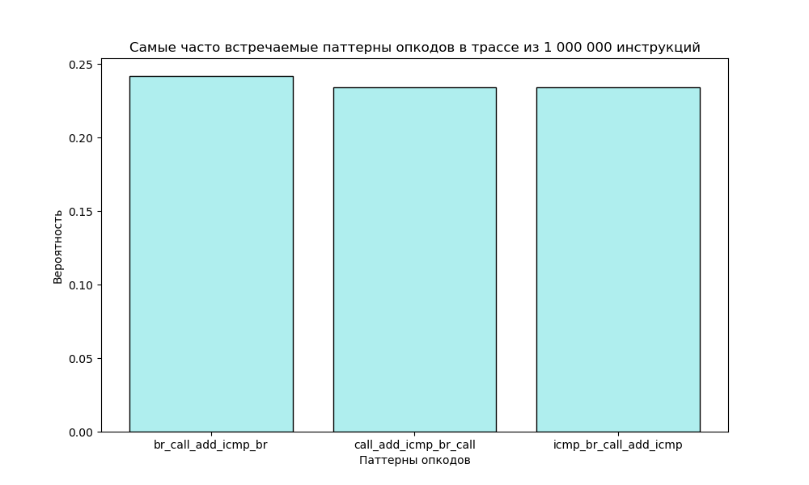
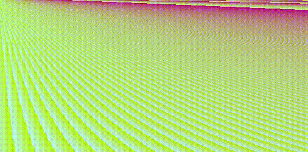

# LLVM COURSE

 
 


## Содержание

[1. Графическое приложение](#1)

Простое графическое приложение с использованием библиотеки *SDL*

[2. LLVM Pass](#3)

Простой пасс для получения трассы выполнения инструкций графического приложения

Статистика вместе встречающихся опкодов

[3. Генератор LLVM IR](#4)

[4. Ассемблер в IR](#5)

[5. Язык программирования SnakeLang](#6)

[6. Сборка ](#2)

Компиляция *snake*

Получение трассы инструкций *snakePass*

[7. Тестирование](#7)


-----------------------------------------------------------------------------

<a name="1"></a>
 ## Графическое приложение

> [!NOTE]
> **Змейка** фиксированного размера рандомно перемещается по окну.
> Если она попадает в ситуацию, когда невозможно выбрать путь без самопересечения, она умирает.

```bash
$ ./snake
```

 

-----------------------------------------------------------------------------

<a name="3"></a>
 ## LLVM Pass

> [!NOTE]
> **TracePlugin** - пасс для clang, вставляющий перед каждой инструкцией вызов функции-коллбэка. 
>
> В нашем случае этот коллбэк собирает трассу исполнения. Затем анализируется частота вместе встречающихся опкодов.

```bash
$ ./snakePass
```
```
Трасса в файле: Trace.txt
Статистика повторения опкодов для трассы в файле: Statistic.txt
```

На основе файла *Statistic.txt* можно построить графики:


 
 
 
 
 

Видно, что самая встречающаяся инструкция -- *br*, которая часто встречается вместе с *icmp*. Самый частый из более длинных паттернов -- цепочка *add*-*icmp*-*br*.

-----------------------------------------------------------------------------

<a name="4"></a>
 ## Генератор LLVM IR

> [!NOTE]
> **genInterpretIR** - программа, которая печатает LLVM IR упрощенного приложения *snakeSimple* в файл (*IR_Gen-Interpret/OutputIR.dump*). Этот LLVM IR практически идентичен тому, что сгенерировал clang (*LLVM_IR/Snake.ll*).
>
> Затем этот IR интерпретируется и ненадолго появляется графическое окно со змейкой. 

```bash
$ ./genInterpretIR
```
```
LLVM IR в файле OutputIR.dump
```

-----------------------------------------------------------------------------
 
<a name="5"></a>
 ## Ассемблер в IR

> [!NOTE]
> **execAsm** - программа, которая выполняет программу на ассемблере. Она также создаёт из этого ассемблера LLVM IR. 


### Поддерживаемые инструкции

| Инструкция  | Аргументы | Описание         |
|:------------- |:----------|:----------------------------:|
|  **ADDI**       |  **rd rs1 imm**          | rd = rs1 + imm |
|  **ADD**       |  **rd rs1 rs2**          | rd = rs1 + rs2 |
|  **XOR**       |  **rd rs1 rs2**          | rd = rs1 ^ rs2 |
|  **CMP_EQ**       |  **rd rs1 rs2**          | rs1 == rs2 ? rd = 1 : rd = 0 |
|  **CMP_LT**       |  **rd rs1 rs2**          | rs1 < rs2 ? rd = 1 : rd = 0 |
|  **BR_NOT**       |  **rs label**          | Eсли rs == false, label - метка для перемещения, иначе проваливаемся дальше |
|  **UPDATE_SCREEN**       |   **-**     | Обновить экран |
|  **PUT_PIXEL**       |  **rs1 rs2 imm**          | Поместить пиксель цвета imm в (x, y) = (rs1, rs2) |
|  **EXIT**       |     **-**    | Выйти из программы |


Для запуска программы (--dumpIR - необязательный флаг):

```bash
$ ./execAsm Snake.s --dumpIR
```

Пример ассемблера *Snake.s* можно найти в *lib/ASM_to_IR/* директории.

Программа будет выполнена, а LLVM IR будет распечатан на экране.

-----------------------------------------------------------------------------
 
<a name="6"></a>
 ## Язык программирования SnakeLang

> [!NOTE]
> **SnakeLang** - программа, которая выполняет программу на языке *SnakeLang*. Она также создаёт из этой программы LLVM IR. 

 

### Ключевые слова и символы

> [!IMPORTANT]
> Все ключевые слова начинаются с **Ss**, имена переменных и функций, за исключением **SsMain**, не могут начинаться с этих символов. **Ss** - голова змеи. Все утверждения должны заканчиваться двумя нижними подчеркиваниями **__**, это хвост змеи. Таким образом, программа состоит из змей.


| Слово / символ | Аргументы | Описание         |
|:------------- |:----------|:----------------------------:|
|  **SsFun**       |  **FName**          | Начало функции **FName** |
|  **SsMain**       |  **Утверждения**          | Обязательная функция, с которой начинается выполнение |
|  **}**       |  **-**          | Конец функции |
|  **SsCall**       |  **FName**          | Вызов функции **FName** |
|  **SsIf**       |  **(Cond) : Flabel Tlabel:**          | Условный переход на метку. Cond == 0 ? Flabel : Tlabel: |
|  **SsCrawl**       |  **label**          |  Переползти на метку **label** |
|  **SsCrOut**       |  **(Expr)**          | Выползет численное значение **Expr** на экран |
|  **SsUpdateScreen**       |   **-**     | Обновить экран |
|  **SsPutPixel**       |  **(x, y, color)**          | Поместить пиксель цвета **color** в (**x**, **y**) положение на экране |
|  **__**       |     **-**    | Конец строки |
|  **//**       |     **-**    | Однострочный комментарий |
|  **label:**       |     **Утверждения**    | Метка с именем **label**. На неё можно переползать. |


### Пример программы

```bash
$ cat Draw.sl
```

```c
// Function that draw in screen
SsFun drawScreen {
  y = 0__
  SsCrawl loopY__
  loopY:
    x = 0__
    SsIf (y < 256) : loopYEnd__
      loopX:
        SsIf (x < 512) : loopXEnd__
          iterX:
            color = 12187338 + x*y/100 + x*100/(y+1)*step__
            SsPutPixel(x, y, color)__
            x = x + 1__
            SsCrawl loopX__
      loopXEnd:
        y = y + 1__
        SsCrawl loopY__
  loopYEnd:
}

// Main Function
SsFun SsMain {
  step = -10__
  SsCrawl loopStep__
  loopStep:
    SsCall drawScreen__
    SsUpdateScreen__
    SsIf (step < 50) : loopStepEnd__
      iterStep:
        step = step + 1__
        SsCrawl loopStep__
  loopStepEnd:
}
```

Для запуска:

```bash
$ ./SnakeLang Draw.sl
```

Программа будет выполнена, а LLVM IR будет сдамплен в файл *llvmIR.txt*.

На экране будет:

 

```bash
$ cat llvmIR.txt
```
```c
; ModuleID = 'top'
source_filename = "top"

@y = external global i32
@x = external global i32
@step = external global i32
@color = external global i32

declare void @putPixel(i32, i32, i32)
declare i32 @printf(i8*, ...)
declare void @updateScreen()

define void @drawScreen() {
entry:
  store i32 0, i32* @y, align 4
  br label %loopY

loopY:                                            ; preds = %loopXEnd, %entry
  ... 
  br i1 %3, label %loopX, label %loopYEnd

loopX:                                            ; preds = %iterX, %loopY
  ... 
  br i1 %7, label %iterX, label %loopXEnd

loopYEnd:                                         ; preds = %loopY
  ret void

iterX:                                            ; preds = %loopX
  ... 
  call void @putPixel(i32 %21, i32 %22, i32 %23)
  ...
  br label %loopX

loopXEnd:                                         ; preds = %loopX
  ... 
  br label %loopY
}

define void @SsMain() {
entry:
  store i32 -10, i32* @step, align 4
  br label %loopStep

loopStep:                                         ; preds = %iterStep, %entry
  call void @drawScreen()
  call void @updateScreen()
  ...
  br i1 %3, label %iterStep, label %loopStepEnd

iterStep:                                         ; preds = %loopStep
  ... 
  br label %loopStep

loopStepEnd:                                      ; preds = %loopStep
  ret void
}
``` 

Пример программы *Snake.sl*, которая рисует змейку, можно найти в *lib/Frontend/* директории, там же её *llvmIR.txt*.


-----------------------------------------------------------------------------
 
 <a name="2"></a>
 ## Сборка 

> [!IMPORTANT]
> Для графического окна нужен интерфейс **SDL2**.

На Linux его можно установить так:
```bash
$ sudo apt-get install libsdl2-dev
```


> [!IMPORTANT]
>Для сборки языка *SnakeLang* должны быть установлены и находиться в **PATH** следующие программы
>(либо запуск происходит в контейнере, где они есть :smile: ):
* **flex**
* **bison**


Для сборки всего, находясь в корневой директории проекта:
 
```bash
$ cmake   -B build
$ cd build/
$ make
```

* Программа *snake* и *snakeSimple* будут в *build/lib/GraphicalApp*.
* LLVM IR для *snakeSimple* будет в *build/lib/LLVM_IR*.
* Программа *snakePass* будет в *build/lib/LLVM_Pass*.
* Программа *genInterpretIR* будет в *build/lib/IR_Gen-Interpret*.
* Программа *execAsm* будет в *build/lib/ASM_to_IR*.
* Программа *SnakeLang* будет в *build/lib/Frontend*.


-----------------------------------------------------------------------------

<a name="7"></a>
 ## Тестирование

> [!IMPORTANT]
>Для проверки языка *SnakeLang* должны быть установлены и находиться в **PATH** следующие программы
>(либо запуск происходит в контейнере, где они есть :smile: ):

* **FileCheck**

Чтобы запустить *тестирование SnakeLang* нужно, находясь в `build`:  

```bash
  $ cd Test/
  $ ./SnakeLangTests
```
С использованием тестового фреймворка **GoogleTest** будут запущены тесты из 
`Test/SnakeLangTests/Data`. 

Результаты тестирования будут на экране:

```yaml
...
[ RUN      ] SnakeLang.Test11
[       OK ] SnakeLang.Test11 (249 ms)
[----------] 11 tests from SnakeLang (3261 ms total)

[==========] 11 tests from 1 test suite ran. (3261 ms total)
[  PASSED  ] 11 tests.
```
 
 
