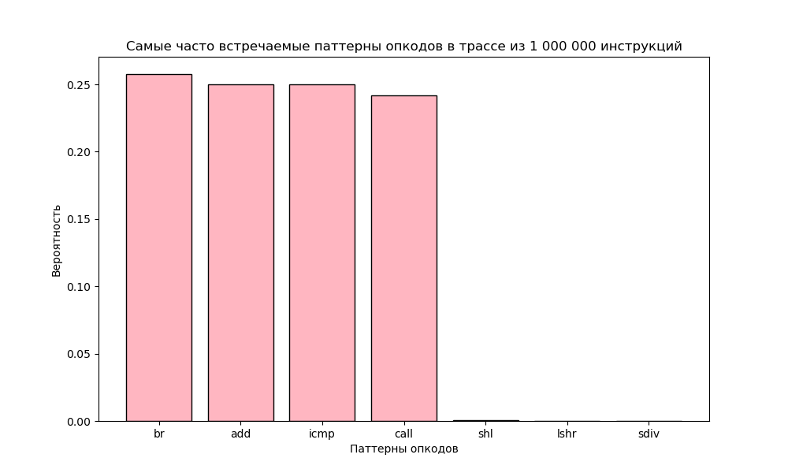
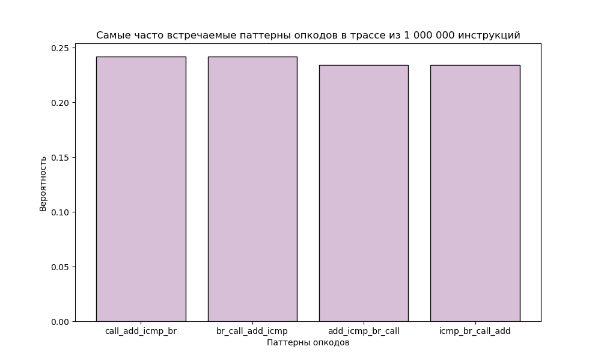

# LLVM COURSE

 
 


## Содержание

[1. Графическое приложение](#1)

Простое графическое приложение с использованием библиотеки *SDL*

[2. LLVM Pass](#3)

Простой пасс для получения трассы выполнения инструкций графического приложения

Статистика вместе встречающихся опкодов

[3. Генератор LLVM IR](#4)

[4. Ассемблер в IR](#5)

[5. Сборка ](#2)

Компиляция *snake*

Получение трассы инструкций *snakePass*


<a name="1"></a>
 ## Графическое приложение

> [!NOTE]
> **Змейка** фиксированного размера рандомно перемещается по окну.
> Если она попадает в ситуацию, когда невозможно выбрать путь без самопересечения, она умирает.

```
$ ./snake
```

 

-----------------------------------------------------------------------------

<a name="3"></a>
 ## LLVM Pass

> [!NOTE]
> **TracePlugin** - пасс для clang, вставляющий перед каждой инструкцией вызов функции-коллбэка. 
>
> В нашем случае этот коллбэк собирает трассу исполнения. Затем анализируется частота вместе встречающихся опкодов.

```
$ ./snakePass
```
```
Трасса в файле: Trace.txt
Статистика повторения опкодов для трассы в файле: Statistic.txt
```

На основе файла *Statistic.txt* можно построить графики:


 
 
 
 
 

Видно, что самая встречающаяся инструкция -- *br*, которая часто встречается вместе с *icmp*. Самый частый из более длинных паттернов -- цепочка *add*-*icmp*-*br*.

-----------------------------------------------------------------------------

<a name="4"></a>
 ## Генератор LLVM IR

> [!NOTE]
> **genInterpretIR** - программа, которая печатает LLVM IR упрощенного приложения *snakeSimple* в файл (*IR_Gen-Interpret/OutputIR.dump*). Этот LLVM IR практически идентичен тому, что сгенерировал clang (*LLVM_IR/Snake.ll*).
>
> Затем этот IR интерпретируется и ненадолго появляется графическое окно со змейкой. 

```
$ ./genInterpretIR
```
```
LLVM IR в файле OutputIR.dump
```

-----------------------------------------------------------------------------
 
<a name="5"></a>
 ## Ассемблер в IR

> [!NOTE]
> **execAsm** - программа, которая выполняет программу на ассемблере. Она также создаёт из этого ассемблера LLVM IR. 


### Поддерживаемые инструкции

| Инструкция  | Аргументы | Описание         |
|:------------- |:----------|:----------------------------:|
|  **ADDI**       |  **rd rs1 imm**          | rd = rs1 + imm |
|  **ADD**       |  **rd rs1 rs2**          | rd = rs1 + rs2 |
|  **XOR**       |  **rd rs1 rs2**          | rd = rs1 ^ rs2 |
|  **CMP_EQ**       |  **rd rs1 rs2**          | rs1 == rs2 ? rd = 1 : rd = 0 |
|  **CMP_LT**       |  **rd rs1 rs2**          | rs1 < rs2 ? rd = 1 : rd = 0 |
|  **BR_NOT**       |  **rs label**          | Eсли rs == false, label - метка для перемещения, иначе проваливаемся дальше |
|  **UPDATE_SCREEN**       |   **-**     | Обновить экран |
|  **PUT_PIXEL**       |  **rs1 rs2 imm**          | Поместить пиксель цвета imm в (x, y) = (rs1, rs2) |
|  **EXIT**       |     **-**    | Выйти из программы |


Для запуска программы (--dumpIR - необязательный флаг):

```
$ ./execAsm Snake.s --dumpIR
```

Пример ассемблера *Snake.s* можно найти в *lib/ASM_to_IR/* директории.

Программа будет выполнена, а LLVM IR будет распечатан на экране.

-----------------------------------------------------------------------------
 
 <a name="2"></a>
 ## Сборка 

> [!IMPORTANT]
> Для графического окна нужен интерфейс **SDL2**.

На Linux его можно установить так:
```
$ sudo apt-get install libsdl2-dev
```


Для сборки всего, находясь в корневой директории проекта:
 
```
$ cmake   -B build
$ cd build/
$ make
```

* Программа *snake* и *snakeSimple* будут в *build/lib/GraphicalApp*.
* LLVM IR для *snakeSimple* будет в *build/lib/LLVM_IR*.
* Программа *snakePass* будет в *build/lib/LLVM_Pass*.
* Программа *genInterpretIR* будет в *build/lib/IR_Gen-Interpret*.


